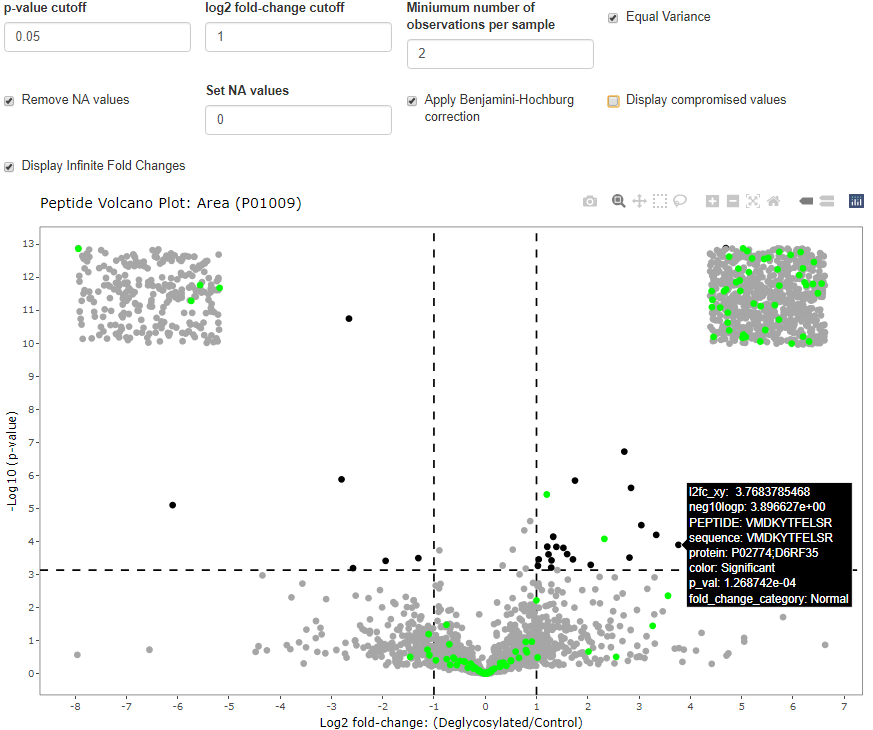

<style>
#borderimage {
  border: 1px solid #000000;
}
</style>


Protein Intensity Mapper (PrIntMap-R)
=====================

# Overview
PrIntMap-R is a suite of visualization tools designed to help with the analysis of shotgun proteomic data at the protein coverage level. The plots generated here can help to visualize uneven coverage of a protein, compare two or multiple samples, and look at the different peptides that contribute to the overall coverage of the protein. For use examples, as well as example data for download, check out the `Examples` tab. To use the tools, click on the `Run` tab.  

-------

# Inputs

### Database File
The database file should contain all the proteins that you may be interested in, and generally should be the same file used in your database search. This file should be in [UniProt fasta format](https://www.uniprot.org/help/fasta-headers) which looks like this:
```
>db|UniqueIdentifier|EntryName ProteinName OS=OrgName OX=OrgID [GN=GGN ]PE=PE SV=SV
AMINOACIDSEQUENCEPEPTIDE...
```
The program will ask for an `Accession ID`. This generally is the `UniqueIdentifier` in the example above, but it will actually match anything in the `UniqueIdentifier` or `EntryName` fields.

### Peptide Files
The peptide files are exported from the database search. These are either `.csv`, `.tsv`, or `.txt` files. Currently supported formats are from [PEAKS](https://www.bioinfor.com/peaks-online/), [MSFragger](https://msfragger.nesvilab.org/), [MaxQuant](https://www.maxquant.org/), [MetaMorpheus](https://github.com/smith-chem-wisc/MetaMorpheus) and [Proteome Discoverer](https://www.thermofisher.com/us/en/home/industrial/mass-spectrometry/liquid-chromatography-mass-spectrometry-lc-ms/lc-ms-software/multi-omics-data-analysis/proteome-discoverer-software.html). Additionally, users can upload peptide data in a generic .csv format (described below) that they compile themselves.

* __PEAKS:__  
  
<br></br>
To download the PEAKS peptide file from a database search, click on the export tab, and then select the `Peptide CSV` option as shown in the image above. If you click `DOWNLOAD BY SAMPLE`, then you will select the `Individual Sample` option in PrIntMap-R. If you select `DOWNLOAD`, then all your samples will be combined into one `.csv` file, and you will select `Combined` in PrIntMap-R. See the `Other Options` section below for more information on `Individual Sample` vs `Combined`. LFQ data from PEAKS can also be analyzed. All downloaded LFQ data will be in a combined file called `lfq.peptides.csv`, unless you have changed the default file name. LFQ intensity will be accessible by selecting the "Area" metric within PrIntMap-R.   
  
* __MSFragger:__  
For individual sample files, go into the directory for the sample of interest, and select the `peptide.tsv` file. For Combined files, select `combined_peptide.tsv` or `combined_modified_peptide.tsv`.  
* __MaxQuant:__  
MaxQuant only has combined files as outputs. To find the peptide file, go into the `/combined/txt/` directory in the search output folder, and select the `peptides.txt` file.  
* __MetaMorpheus:__  
For individual files containing intensity (TIC) and PSMs, navigate to the `SearchTask/Individual File Results` directory, and then select the `Peptides.psmtsv` file corresponding to the sample of interest. There are two types of combined files: in the `SearchTask` directory the TIC (intensity) and PSM data is found within the `AllPeptides.psmtsv` file, while the LFQ (Area) data is found in the `AllQuantifiedPeptides.tsv` file. Note that for comparing two or more samples, both must be of the same file type when using Metamorpheus combined files.  
* __Proteome Discoverer:__   
Export PeptideGroups as a `.txt` file which will be in tab delineated format.  
* __Generic csv:__  
For individual files, create a csv file. Place peptide sequences in a column with the title `Peptide`. Place intensity data in columns called `Area`, `Intensity`, and `PSM`. At least one of these columns is required. An additional optional column called `protein` can be added, with accession information. Matching case for these column titles is required. See example below:  
  
<br></br>  
For combined files, create a csv file. Place peptide sequences in a column with the title `Peptide`. For each peptide sequence, put intensity data in columns titled in the following pattern: `Sample1.Area`, `Sample2.Area`, `Sample1.Intensity`, `Sample2.Intensity`, `Sample1.PSM`, `Sample2.PSM`, etc. The important aspects for these columns are that the sample names are unique, and that they are separated from the `Area`, `PSM`, or `Intensity` label with a `.` Avoid spaces in the sample names for best results (Use periods or underscores instead). These columns can be in any order. At least one type of intensity must be present for each sample. An additional optional column called `protein` can be added, with accession information. Matching case for all column titles is required. See example below:  
  
<br></br>


### Other Options
* __Sample Display Name:__  
This is simply whatever you want the sample to be called in plot legends and export csv files.  
* __Individual Sample vs Combined (RegEx sample name):__  
If the peptide file contains information for only one sample (i.e. only one column for PSMs, Intensity, etc for each peptide) then it is an individual file. If there are multiple samples contained within one file, it is a combined file, and the columns will include the name of the sample. For example `Sample A.Spectral Count`. In this case, to specify which columns to include, use [RegEx](https://cran.r-project.org/web/packages/stringr/vignettes/regular-expressions.html) in the provided text input field to specify sample names. For example, if I had two samples: Sample A and Sample B, and three technical replicates of each (Samp_A_1, Samp_A_2, Samp_A_3, Samp_B_1, etc), I could specify to include only sample A by inputing `Samp_A`. To include both samples in the data, I could either leave the field blank, or input `Samp`. To only include the first replicate of sample A, I could specify `Samp_A_1`. Be sure to look at your data to see how your columns are named. For most search software, the sample name to use is whatever was specified in the experimental setup. For MetaMorpheus, the raw file names are used to name the samples. **Important:** When importing data, R will convert spaces and dashes (`-`) in column names to periods: `.` Keep this in mind if your samples have these characters, or other RegEx special characters in their names. More regex examples can be found below in the documentation.  
* __Search Software:__  
Select the search software used from the dropdown menu. If the file provided does not match the format of the search software output, an error will be shown.  
* __Protein Accession ID:__  
This is the identifier for the protein of interest. This field uses RegEx, but requires that it matches to only one protein in the database provided. Messages will indicate if the protein cannot be found, or if multiple proteins were found. See the database file format example above for more details.  
* __Intensity Metric:__  
This gives the option of displaying the number of spectra matches (PSM), the intensity (usually equivalent to peak height in TIC), or the peak area as the y-axis metric. For search software that performs LFQ, This data will be used for the `Area` metric. Depending on the combination of file type and searh software, some of the intensity options will not be available.  
* __y-axis Scale:__  
Whether to display the y-axis on a linear or log scale. Generally PSMs work best in linear, and intensity and area best work with a log scale. The log transformation is actually a [pseudolog](https://scales.r-lib.org/reference/pseudo_log_trans.html) transformation which allows for values of 0. The log scale will not show negative values, so using the Log scale when comparing the difference in intensity between two samples may be impractical.  
* __Display Origin Peptides:__  
When checked, the plot will show the peptides that contributed to the y-axis intensity for every amino acid when the mouse is hovered on a particular datapoint. See example screenshot below.  


-------

# Outputs
The outputs are generally [ggplot objects](https://ggplot2.tidyverse.org/index.html) displayed using the [plotly package](https://plotly.com/graphing-libraries/), which allows for interaction. By mousing over the plot, you are able to see options in the top right corner such as 'save as png'. Clicking and dragging on the plot will allow zooming. Double clicking anywhere resets the original axes. Mousing over the data will show information such as amino acid 1-letter code, amino acid position, peptides of origin, and intensity value. The plots are grouped into tabs depending on the number of samples you want to analyze: One, Two, or Multiple.  


## One Sample  

### Intensity Trace
The basic plot. This will show intensity on the y-axis (either PSMs, Area, or Intensity), and amino acid position on the x-axis. Hovering over the data will display additional information.  
  

### Stacked Peptide Plot  
Displays all identified peptides stacked where they are found on the amino acid sequence. Mousing over the plot shows additional peptide information. The y-axis by default is simply an increaseing series so that peptides don't overlap in the y direction. However, the option exists to plot intensity (PSM, area, or intensity) on the y axis. Log and linear options are available. Peptides are colored by intensity, with black for intensity of NA.  

<br/><br/>
  

### Unique Peptides
This option searches through the entire provided proteome, and determines whether peptides are unique to the protein of interest or not. Also determines whether there are any repeated peptides within the protein. Displays output as a color coded plot. This option can take significant time depending on number of peptides and length of protein.  
<br/><br/>


### Percent Coverage
Calculates the percent coverage for the protein by simply dividing the number of amino acids observed by the number of total amino acids. Note that NA values are not included, so for area and intensity which may contain NAs, the percent coverage can be lower than for PSM.

## Two Samples

### Intensity Traces
Allows for the comparison of two different samples. The second peptide information can be uploaded in the same way as the first, by clicking on the '2nd Peptide Input' button. Options include overlaying the two samples, subtracting sample 2 from sample 1 (difference), and dividing sample 2 by sample 1 (fold change). In this setup, if sample 2 is greater than sample 1, the value will be above 1, and if sample 1 is greater than sample 2 the value will be below 1. If sample 2 contains a value, and sample 1 does not, the value will be displayed at 1.25x the highest value, and highlighted with a green dot. If sample 1 contains a value and sample 2 does not, the value will be displayed at 0, and highlighted with a red dot.  

<br/><br/>

<br/><br/>


### Volcano Plots
Peptide volcano plots can be generated comparing two samples if enough information is supplied. These require combined file types, so that enough replicate values can be used for the statistical calculations. Options include changing the p-value cutoff, the minimum number of non NA values for each sample type, the log2 fold change cutoff for significance, and whether to apply the [Benjamini-Hochburg](https://www.jstor.org/stable/2346101#metadata_info_tab_contents) correction. Values with infinite and negative infinite values can be displayed or hidden. These are values that have intensity values in one sample, and no intensity values in the other. When displayed, they show up as a block in the upper corners of the plot. "compromised values" can also be displayed or hidden. These are values where one of the samples contains sufficient data for a calculation, and the other sample does not contain sufficient data, but is not NA. Peptides mapping to a protein of interest can be highlighted. The p-value is calculated with an unpaired two-tailed t-test either assuming or not assuming equal variance. NA values are ignored, unless the 'remove NA' box is unchecked, in which case NA values are replaced by the supplied value (default zero).  



## Multiple Samples
Multiple Samples will be displayed as an overlaid intensity plot. The peptide files can be entered the same as the original peptide file. For the `Difference` and `Fold Change` options, each sample is compared to the first sample that is shown in the basic tab. In the `Overlay` option, all samples are shown including the first sample from the basic tab.  


<br/><br/>

<br/><br/>


# Customizing the plots  
The following customizations can be added to overlaid intensity traces or the stacked peptide plot in either one, two, or multiple samples. These customizations can be accessed in the dropdown menus above the plots. Different combinations of Annotations and PTMs can be used.  

## Annotation
Allows for the overlay of specific sequence features on the intensity plots generated in `One Sample`, `Two Samples`, and `Multiple Samples`. A preset annotation can be selected from the menu (e.g. potential N-glycosylation sites or trypsin cut sites) or a custom annotation can be typed using RegEx.  

<br/><br/>

<br/><br/>
   

## Post Translational Modifications (PTMs)
Allows for the annotation of identified PTMs from a database search. Currently PEAKS and generic csv formats are supported, with plans to implement additional formats in the future. The annotation style for PEAKS and generic csv is the same, with the PTM being places in parenthesis behind the amino acid that it affects. The parenthesis contain the mass shift (to 2 decimal places) caused by the PTM. For example, a deamidation of asparagine would look like this: `GLLAPN(+0.98)ETSR`. The annotated plot can be the plot generated by any of the other tabs (except for unique peptides). Note that whatever is currently present in each tab will be annotated, so for example to change the annotated enzyme from the annotation tab, you must go to the annotation tab, select the enzyme of interest, and return to the PTM tab and select "Annotation". This is important for "Multiple samples" because the plot doesn't update on that tab until the update button is clicked. Mousing over the PTM gives additional information, including a ratio that shows what percent of the total intensity (y-axis) comes from peptides that contained that PTM. For example, if one asparagine residue appeared in 2 different versions of a peptide and the version with a deamidated asparagine had an area of 1,000,000 and the version of the peptide without the deamidation had an area of 9,000,000, this ratio would be 0.10. Multiple PTMs can be selected at once, and custom PTMs can be entered using regex. See examples below.    


<br/><br/>

<br/><br/>
 
<br/><br/>
  

# Export Tab
Provides the plotable data as a `.csv` file that can be downloaded. Option of downloading just the initial sample, two samples, or multiple samples.

### Regex Examples  
There are several places in the application where the user can use regular expressions (regex) to customize their experience, specifically with custom annotations, and selecting specific samples/injections from combined input files. For a summary of regex in R and how they are used in the stringr package, see [this link](https://cran.r-project.org/web/packages/stringr/vignettes/regular-expressions.html). Regex is very flexible, and almost any possible subset of strings can be matched. Several examples are explained below.  
 
* __Selecting specific replicates to display:__ In this example, imagine that you have a combined .csv input file with 6 different injections (replicates 1-6) of two samples (Sample A and Sample B) where the injections are named `SampleA_Replicate_1, SampleB_Replicate_1, SampleA_Replicate_2, SampleB_Replicate_2, ..., SampleA_Replicate_6, SampleB_Replicate_6`.  

    To select all of the replicates from Sample A, a possible regex input would be `SampleA.*`. This will match anything that contains the text "SampleA" followed by any other characters. The "." matches any character, and the "*" means that there can be any number of the previous character. A more specific example that would also select all of the Sample A replicates would be `SampleA_Replicate_[1-6]`. In this case, the number range within the square brackets mean that any numbers between 1 and 6 will match the character after the underscore.  

    To select replicates 1-3 of both sample A and B, one option would be `Sample[AB]_Replicate_[1-3]`. The number range works the same as the above example, but now only includes replicates 1-3. When two or more characters are contained within square brackets without a dash, any of those characters by themselves will match (essentially 'or' logic). Another option would be `Sample[:alpha:]_Replicate_[123]`. The or logic is now applied to the replicate number, and the character after 'Sample' will match to any alphabetical character.  
    
* __Creating a custom annotation:__ In this example, imagine that you want to annotate the amino acid sequence E - G or A - Any amino acid except for proline - E. This four character sequence can be achieved with several possible combinations. `E[AG][AGILVFWYDERHKSTCMNQ]E` will match, because any character enclosed within square brackets will match. Another options would be `E[AG][^P]E` is another option. The "^P" means any character besides P.

## Local Version
Sometimes if your peptide file has many samples or your database is very large, the web app will time out. If you repeatedly experience this, try running the app locally on your computer. Follow instructions on the `README` file at the [github repo](https://github.com/Champion-Lab/PrIntMap-R/) for this project.  

## Citation  
If you use PrIntMap-R, please cite:

Weaver SD, DeRosa CM, Champion MM. *PrIntMap-R*. 2022. Accessed *date*. Version *X.X.X*. https://championlab.shinyapps.io/printmap-r/


## Questions, Comments, Suggestions, Bugs
Please leave all of the above on the [github page](https://github.com/Champion-Lab/PrIntMap-R/).
  
------

  
[Champion Lab](https://championlab.weebly.com/), University of Notre Dame  
  
<sup>By Simon D. Weaver and Christine M. DeRosa</sup>
