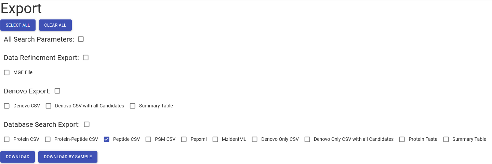
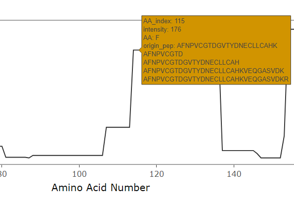
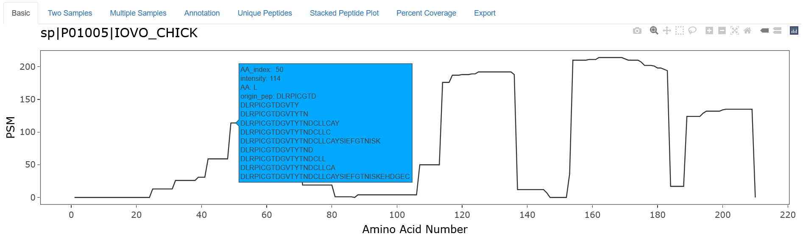
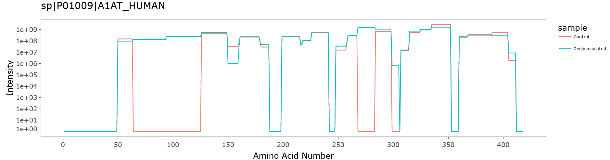
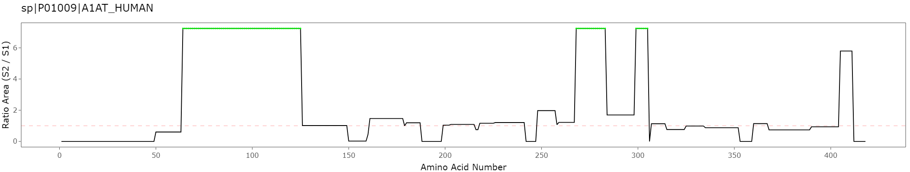
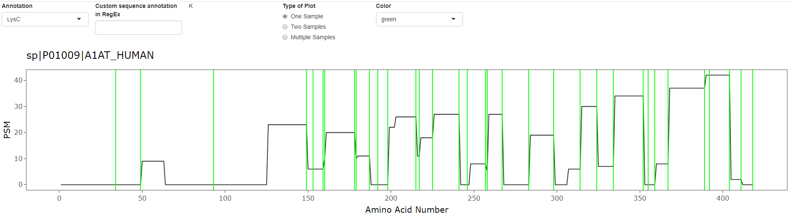
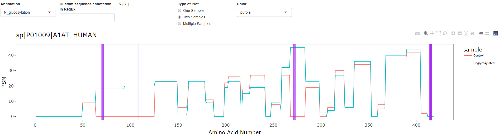
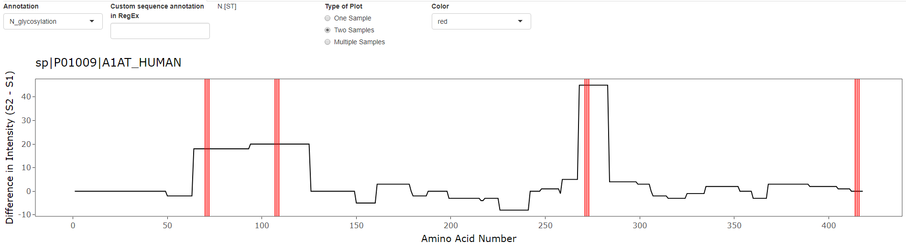
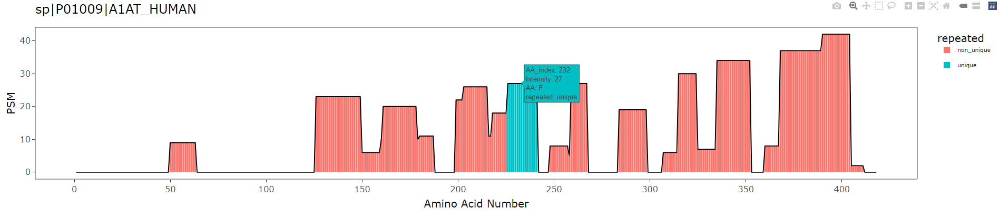
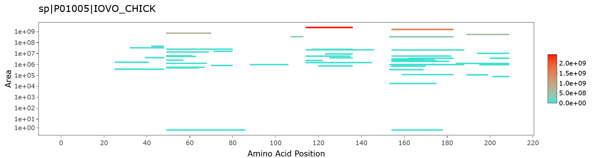

<style>
#borderimage {
  border: 1px solid #000000;
}
</style>


Protein Intensity Mapper (PrIntMap-R)
=====================

# Overview
PrIntMap-R is a suite of visualization tools designed to help with the analysis of shotgun proteomic data at the protein coverage level. The plots generated here can help to visualize uneven coverage of a protein, compare two or multiple samples, and look at the different peptides that contribute to the overall coverage of the protein. For use examples, as well as example data for download, check out the `Examples` tab. To use the tools, click on the `Run` tab.  

-------

# Inputs

### Database File
The database file should contain all the proteins that you many be interested in, and generally should be the same file used in your database search. This file should be in [UniProt fasta format](https://www.uniprot.org/help/fasta-headers) which looks like this:
```
>db|UniqueIdentifier|EntryName ProteinName OS=OrgName OX=OrgID [GN=GGN ]PE=PE SV=SV
AMINOACIDSEQUENCEPEPTIDE...
```
The program will ask for an `Accession ID`. This generally is the `UniqueIdentifier` in the example above, but it will actually match anything in the `UniqueIdentifier` or `EntryName` fields.

### Peptide Files
The peptide files are exported from the database search. These are either `.csv`, `.tsv`, or `.txt` files. Currently supported formats are from [PEAKS](https://www.bioinfor.com/peaks-online/), [MSFragger](https://msfragger.nesvilab.org/), and [MaxQuant](https://www.maxquant.org/), with plans to include Proteome Discover and MetaMorpheus soon.  

* __PEAKS:__  
  
<br></br>
To download the PEAKS peptide file from a database search, click on the export tab, and then select the `Peptide CSV` option as shown in the image above. If you click `DOWNLOAD BY SAMPLE`, then you will select the `Individual Sample` option in PrIntMap-R. If you select `DOWNLOAD`, then all your samples will be combined into one `.csv` file, and you will select `Combined` in PrIntMap-R. See the `Other Options` section below for more information on `Individual Sample` vs `Combined`.  
  
* __MSFragger:__  
For individual sample files, go into the directory for the sample of interest, and selet the `peptide.tsv` file. For Combined files, select `combined_peptide.tsv`.  
* __MaxQuant:__  
MaxQuant only has combined files as outputs. To find the peptide file, go into the `/combined/txt/` directory in the search output folder, and select the `peptides.txt` file.
* __Proteome Discover:__  
  * *Coming Soon*  
* __MetaMorpheus:__  
  * *Coming Soon*  

### Other Options
* __Sample Display Name:__  
This is simply whatever you want the sample to be called in plot legends and export csv files.  
* __Individual Sample vs Combined (RegEx sample name):__  
If the peptide file contains information for only one sample (i.e. only one column for PSMs, Intensity, etc for each peptide) then it is an individual file. If there are multiple samples contained within one file, it is a combined file, and the columns will include the name of the sample. For example `Sample A.Spectral Count`. In this case, to specify which columns to include, use [RegEx](https://cran.r-project.org/web/packages/stringr/vignettes/regular-expressions.html) in the provided text input field to specify sample names. For example, if I had two samples: Sample A and Sample B, and three technical replicates of each (Samp_A_1, Samp_A_2, Samp_A_3, Samp_B_1, etc), I could specify to include only sample A by inputing `Samp_A`. To include both samples in the data, I could either leave the field blank, or input `Samp`. To only include the first replicate of sample A, I could specify `Samp_A_1`. Be sure to look at your data to see how your columns are named. **Important:** When importing data, R will convert spaces in column names to periods: `.` Keep this in mind if your samples have spaces in their names.  
* __Search Software:__  
Select the search software used from the dropdown menu. If the file provided does not match the format of the search software output, and error will be shown.  
* __Protein Accession ID:__  
This is the identifier for the protein of interest. This field uses RegEx, but requires that it matches to only one protein in the database provided. Messages will indicate if the protein cannot be found, or if multiple proteins were found. See the database file format example above for more details.  
* __Intensity Metric:__  
This gives the option of displaying the number of spectra matches (PSM), the intensity (usually equivalent to peak height), or the peak area as the y-axis metric. For MaxQuant and MSFragger, if LFQ data is an option, area will be equivalent to the LFQ value. If LFQ isn't an option, Area and Intensity will be the same.  
* __y-axis Scale:__  
Whether to display the y-axis on a linear or log scale. Generally PSMs work best in linear, and intensity and area best work with a log scale. The log transformation is actually a [pseudolog](https://scales.r-lib.org/reference/pseudo_log_trans.html) transformation which allows for values of 0.
* __Display Origin Peptides:__  
When checked, this checkbox will show the peptides that contributed to the y-axis intensity for every amino acid when the mouse is hovered on a particular datapoint. See example screenshot below.  


-------

# Outputs
The outputs are generally [ggplot objects](https://ggplot2.tidyverse.org/index.html) displayed using the [plotly package](https://plotly.com/graphing-libraries/), which allows for interaction. By mousing over the plot, you are able to see options in the top right corner such as 'save as png'. Clicking and dragging on the plot will allow zooming. Double clicking anywhere resets the original axes. Mousing over the data will show information such as amino acid 1-letter code, amino acid position, peptides of origin, and intensity value.

### Basic
The basic plot. This will show intensity on the y-axis (either PSMs, Area, or Intensity), and amino acid position on the x-axis. Hovering over the data will display additional information.  


### Two Samples
Allows for the comparison of two different samples. The second peptide information can be uploaded in the same way as the first. Options include overlaying the two samples, subtracting sample 2 from sample 1 (difference), and dividing sample 2 by sample 1 (fold change). In this setup, if sample 2 is greater than sample 1, the value will be above 1, and if sample 1 is greater than sample 2 the value will be below 1. If sample 2 contains a value, and sample 1 does not, the value will be displayed at 1.25x the highest value, and highlighted with a green dot. If sample 1 contains a value and sample 2 does not, the value will be displayed at 0, and highlighted with a red dot.  

<br/><br/>

<br/><br/>



### Multiple Samples
Plot multiple samples, will be displayed as an overlay plot. The peptide files can be entered the same as the original peptide file.

### Annotation
Allows for the overlay of specific sequence features on the intensity plots generated in `Basic`, `Two Samples`, and `Multiple Samples`. A preset annotation can be selected from the menu (e.g. potential N-glycosylation sites or trypsin cut sites) or a custom annotation can be typed using RegEx. For the `Two Sample` option, the plot displayed on the `Two Sample` tab will be used, so a fold change or difference plot can be annotated.  

<br/><br/>

<br/><br/>


### Unique Peptides
This option searches through the entire provided proteome, and determines whether peptides are unique to the protein of interest or not. Also determines whether there are any repeated peptides within the protein. Displays output as a color coded plot. This option can take significant time depending on number of peptides and length of protein.  
<br/><br/>


### Stacked Peptide Plot  
Displays all identified peptides stacked where they are found on the amino acid sequence. Mousing over the plot shows additional peptide information. The y-axis by default is simply an increaseing series so that peptides don't overlap in the y direction. However, the option exists to plot intensity (PSM, area, or intensity) on the y axis. Log and linear options are available. Peptides are colored by intensity, with black for intensity of NA.  

<br/><br/>


### Percent Coverage
Calculates the percent coverage for the protein by simply dividing the number of amino acids observed by the number of total amino acids. Note that NA values are not included, so for area and intensity which may contain NAs, the percent coverage can be lower than for PSM.

### Export
Provides the plotable data as a `.csv` file that can be downloaded. Option of downloading just the initial sample, two samples, or multiple samples.

------

  
[Champion Lab]("https://championlab.weebly.com/), University of Notre Dame  
  
<sup>By Simon D. Weaver and Christine M. DeRosa</sup>

